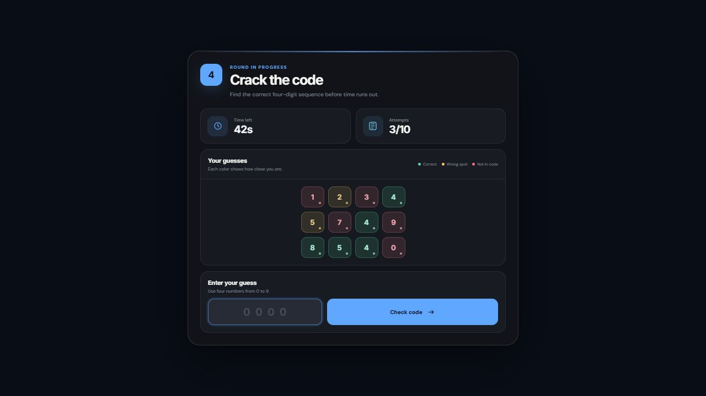
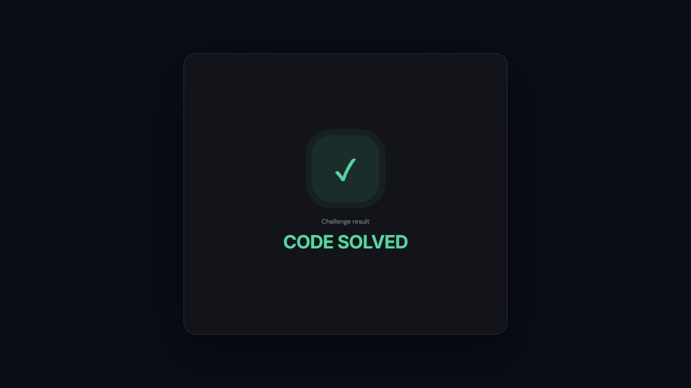

# ST Mastermind

[العربية](#النسخة-العربية) | [English](#english-version)

## صور الواجهة الجديدة | New UI Preview





---

## النسخة العربية

لعبة Mastermind مستقلة بواجهة NUI لسيرفرات FiveM. يجب على اللاعب اكتشاف رمز مكوّن من أربعة أرقام قبل انتهاء الوقت أو استهلاك جميع المحاولات.

### المطور والدعم

- المطور: `ii_abual3bed | stdev`
- ديسكورد: https://discord.gg/HCskVYZPtB

### المميزات

- رمز من أربعة أرقام غير مكررة
- وقت وعدد محاولات قابلان للتعديل
- ألوان توضح نتيجة كل رقم
- واجهة حديثة بتصميم أمني
- شاشة مستقلة لنتيجة النجاح أو الفشل
- إلغاء اللعبة بزر Escape
- Exports لبدء اللعبة وتغيير إعداداتها
- Client event يعيد النتيجة النهائية
- أمر اختبار مدمج

### طريقة اللعب

أدخل أربعة أرقام ثم افحص المحاولة:

- **الأخضر:** الرقم صحيح وفي مكانه الصحيح
- **الأصفر:** الرقم موجود لكن في مكان مختلف
- **الأحمر:** الرقم غير موجود في الرمز

يفوز اللاعب عند اكتشاف الرمز كاملاً. تنتهي اللعبة بالفشل عند انتهاء الوقت، استهلاك جميع المحاولات، أو إغلاق الواجهة.

### التثبيت

1. ضع مجلد `st-mastermind` داخل مجلد resources في السيرفر.
2. إذا كان سيرفرك لا يستخدم ElectronAC، احذف سطر ElectronAC من `fxmanifest.lua`.
3. أضف `ensure st-mastermind` إلى `server.cfg`.
4. شغّل السكربت قبل أي resource يعتمد عليه.

```cfg
ensure st-mastermind
ensure st-vendingrobbery
```

### الاستخدام

ابدأ اللعبة من client script:

```lua
exports['st-mastermind']:StartMiniGame()
```

استقبل النتيجة النهائية:

```lua
AddEventHandler('st-mastermind:finished', function(success)
    if success then
        print('تم حل التحدي بنجاح')
    else
        print('فشل التحدي أو تم إلغاؤه')
    end
end)
```

تكون قيمة `success` مساوية لـ `true` عند الفوز و`false` عند الفشل أو الإلغاء.

### تعديل الإعدادات

تعديل عدد المحاولات:

```lua
exports['st-mastermind']:SetAttempts(6)
```

تعديل الوقت بالثواني:

```lua
exports['st-mastermind']:SetTimer(60)
```

مثال كامل:

```lua
exports['st-mastermind']:SetAttempts(6)
exports['st-mastermind']:SetTimer(60)
exports['st-mastermind']:StartMiniGame()
```

القيم الافتراضية هي 10 محاولات و60 ثانية. تبقى القيم المعدلة فعالة في الجولات التالية حتى يتم تغييرها مرة أخرى.

### أمر الاختبار

استخدم الأمر التالي داخل اللعبة:

```text
/stg
```

### ملاحظات الربط

- تبقى واجهة NUI مخفية حتى استدعاء `StartMiniGame`.
- يتم تحرير NUI focus تلقائياً بعد ظهور النتيجة.
- إيقاف الـ resource يحرر NUI focus.
- الربط Client-side، لذلك استقبل `st-mastermind:finished` في نفس سياق الـ client الذي بدأ اللعبة.

---

## English Version

ST Mastermind is a standalone NUI minigame for FiveM. The player must identify a four-digit code before the timer expires or all attempts are used.

### Author and Support

- Author: `ii_abual3bed | stdev`
- Discord: https://discord.gg/HCskVYZPtB

### Features

- Four-digit code generated with unique digits
- Configurable timer and maximum attempts
- Color feedback for every submitted digit
- Modern security-themed NUI
- Dedicated win and loss result screens
- Escape-key cancellation
- Exports for starting and configuring the game
- Client event containing the final result
- Built-in test command

### How to Play

Enter four digits and check the attempt:

- **Green:** correct digit in the correct position
- **Yellow:** digit exists but is in the wrong position
- **Red:** digit does not exist in the secret code

The player wins by finding the complete code. The game is lost when the timer expires, all attempts are used, or the UI is cancelled.

### Installation

1. Copy `st-mastermind` into your server resources directory.
2. If your server does not use ElectronAC, remove its include line from `fxmanifest.lua`.
3. Add `ensure st-mastermind` to `server.cfg`.
4. Start this resource before scripts that use its exports.

```cfg
ensure st-mastermind
ensure st-vendingrobbery
```

### Usage

Start the minigame from a client script:

```lua
exports['st-mastermind']:StartMiniGame()
```

Listen for the final result:

```lua
AddEventHandler('st-mastermind:finished', function(success)
    if success then
        print('Mastermind completed successfully')
    else
        print('Mastermind failed or was cancelled')
    end
end)
```

The `success` argument is `true` on a win and `false` on a loss or cancellation.

### Configuration Exports

Set the maximum attempts:

```lua
exports['st-mastermind']:SetAttempts(6)
```

Set the timer in seconds:

```lua
exports['st-mastermind']:SetTimer(60)
```

Complete example:

```lua
exports['st-mastermind']:SetAttempts(6)
exports['st-mastermind']:SetTimer(60)
exports['st-mastermind']:StartMiniGame()
```

The default values are 10 attempts and 60 seconds. Changed values remain active for later games until changed again.

### Test Command

Use this client command in-game:

```text
/stg
```

### Integration Notes

- The NUI stays hidden until `StartMiniGame` is called.
- NUI focus is released automatically after the result appears.
- Stopping the resource releases NUI focus.
- Integration is client-side; listen for `st-mastermind:finished` in the same client context that starts the game.

## License | الرخصة

MIT. See `LICENSE`.
